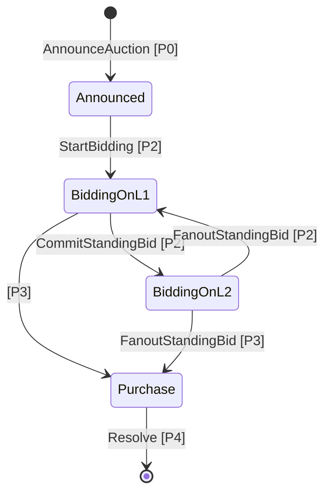

# L2 Auction Additional Features

This document presents the design and specification for two additional features
we are considering to add to Hydra-based auctions in the future:
* Open Auctions
* Full-Backed Bids

## Open Auctions

The most widely valuable use case for auctions is the Open Auction,
which allows anyone to participate in the auction as bidders.

### Problem Statement (Persistent Deposit Sufficiency)

The chief difficulty with running open auctions is 
ensuring the bidder's deposit is sufficient 
and remains until the bidder withdraws from the auction.

In private auctions, we can easily bypass this problem 
by offloading the responsibility to the seller, who is incentivized to ensure the deposit is sufficient,
and a trusted party in regard to the auction.

Public auctions must solve this same problem without the involvement of the seller
after the initial announcement of the auction. 
In order to do this, we will rely on the other class of trusted parties in the auction protocol - the Hydra delegates.

This means no more reliance on seller signatures 
and no need for a method for sending those signatures to prospective bidders 
(such as the Seller Oracle we currently use in private auctions).

### Solution

#### L1

When a prospective bidder places a deposit, they will be able to immediately bid on L1
by referencing the deposit they placed.

These deposits are stored with datums which include the following information: 

```haskell
data PBidderInfo (s :: S)
  = PBidderInfo
      ( Term
          s
          ( PDataRecord
              '[ "biBidderAddress" ':= PAddress
               , "biBidderVk" ':= PByteString
               ]
          )
      )
```

To allow for public auctions instead of private auctions, the standing bid validator must be changed to allow bids to be placed by referencing a datum which: 
- includes a matching bidder's address
- comes with an output that includes a sufficient deposit
- is stored at the correct address

#### L2

On L2, the Hydra delegates are expected to maintain a list of valid deposits.
It's sufficient to have all `Address`es which can be referenced similarly to deposits' datums on L1:
- When the auction is first moved to L2,
the list is created with all sufficient & valid deposits currently placed
at the auction's bidder deposit validator.
- Whenever a new participant who is not currently on that list
attempts to place a bid on L2 the delegate through which that bid is being placed
should first initiate an update to the list of valid deposits
to include all new deposits that have been placed since the last update.
This requires all delegates in the group to sign off on the newer version of permitted `Address`es.

To place a bid on L2, the private standing bid validator
requires the inclusion of a reference to the list of `Address`es 
showing that the bidder is included in the list.

#### Notes

Private auctions cannot be run securely with a standing bid validator 
that includes the public auction endpoints.
This script must be compiled separately for public & private auctions. 
However, a public auction could be run with the private bid endpoint still enabled,
which would allow the seller to admit trusted parties without a deposit.

The L2 bidding system can technically be used in L1 as well,
but there is no need to require bidders to rely on the delegates on L1
when they can easily prove the legitimacy of their deposit on their own.

In the future, should deposit withdrawal be allowed,
this system will need to be updated with more regularity.

### Endpoints

Altogether, the updated redeemers for the public standing bid validator are as follows.

#### `NewBid` (modified)

Bid transactions must now either reference a datum which (for L1 bidding):
- includes a matching address
- includes a sufficient deposit 
- is stored at the bid deposit validator address

OR which (for L2 bidding):
- includes a list of addresses which includes a matching address
- is stored at the standing bid validator address

#### `UpdateRegistry` (new)

- Must output a list of addresses to the standing bid validator.
- Must include the signature of all delegates in the delegate group.

## Fully-Backed Bids

### Problem Statement (Bid Guarantees on L2)

Part of the unique value of auctions is that they provide participants 
with a social system for granular price discovery of the lot. 
This is useful in a variety of situations where the lot's value may not be algorithmically discoverable.

A key consideration when designing blockchain auction protocols is providing guarantees of bid fulfillment by the bidder.
If the winning bidder simply does not pay for the auction after completion, it's not clear what the best solution is.

- The auction lot can be returned to the seller, allowing them to restart the auction.
This represents a monetary and time loss to all participants of the first auction
and provides several potential negative use cases for bad actors.
- The auction can resolve to the second highest bidder.
This breaks the value of price discovery and provides a clear incentive
for bad actors to manipulate the auction for personal gain.

### Current System (Bid Deposits)

The current auction system reinforces bid fulfillment by requiring bidders 
to provide a deposit of some amount determined by the seller, 
which can only be claimed back by the winner if they pay the amount they bid. 
If the bidder wins the auction and fails to pay the amount they bid, 
the deposit can be claimed by the seller.

This is a good solution, but it isn't without its downsides.
It has the benefit of compensating the seller for their lost time and disincentivizing bad actors,
but it doesn't truly guarantee bids, doesn't provide any guarantees for other bidders,
and can potentially hurt honest bidders who have simply missed the window to purchase the lot.

### Future Spec (Fully-Backed Bids)

The simplest solution to the bid guarantee problem on L1 is fully-backed bids - 
requiring bidders to lock the amount of funds they promise in a contract 
which can be withdrawn by the seller when the bidder wins and misses the purchase. 
To increase his bid, the bidder has to increase his bid again with more funds from his wallet. 

On L2, this scheme runs into problems when the flow between the user's wallet on the L1 and their bid on the L2
isn't fast or consistently available. 
We decided against fully backed bids in the initial spec because at the time funds
could only be moved between L1 and L2 when the Hydra head first starts, 
clearly breaking both speed and constancy requirements.

Increasing bids on L2 requires incremental commit/decommit, 
a feature which has recently been rolled out by the Hydra team. 
Unfortunately, according to our analysis, that feature 
is not yet mature enough for integration into our development timeline.
That way we have decided to leave Fully-Backed Bids un-implemented.

### Auction Flow

The auction logic itself greatly simplifies when designing for fully backed bids 
by including the amount of ada specified in the bid in the standing bid utxo,
and enforcing the refunding of the previous bidder when submitting a tx with the `NewBid` redeemer.

With these changes we are able to do without deposits, the reclaim period,
or any extra cleanup transactions, 
and able to discard the many various datum fields and redeemers associated with them.

The simplified auction flow looks like this:



There are two changed state transitions:

<table><tr><td>

</td></tr><tr></tr><tr><td>

`CommitStandingBid [P2]`. During the bidding period, the standing bid can be moved to the Hydra Head,
allowing bidders to place bids in the auction via L2 transactions 
(but no longer via L1). 
This is no longer dependent on the Head Initializing (HI) state, as the commit can be made with the head still running.

</td></tr><tr></tr><tr><td>

`Resolve [P4]`. During the purchase period, anyone can spend the standing bid utxo,
sending the lot to the winning bidder and the deposit to the seller, 
while also recovering the min 2 ADA inside it.

</td></tr></table>

The complications for fully-backed bids come with including the bid-backing assets on L2.
We have considered two ways this might be implemented with incremental commits.

### Granular Commit

With Granular Commit each user is granted permission to move funds into L2 at any time. 
This provides the best user experience by satisfying the speed and constancy requirements.
Potential drawbacks and problems may occur around network over-utilization 
due to the volume of requests from individual users.

Once the Hydra head has been initialized, bidders can move utxos to & from the L2 on demand.

```
Endpoints
 - SendToL2
 - SendToL1
```

### Batch Commits

If throughput between L1/L2 is limited or inconsistent,
it may make more sense to batch commits together.
This would require a slightly different schema:

### L1 Changes

Permissioned bidders may send funds to and from a new `LiquidityQueue` validator,
with datum(s) tracking the ownership of the funds stored there.
The funds may then be committed to the L2 as needed.

```
Endpoints
 - QueueLiquidity
 - WithdrawLiquidity
 - SendToL2
```

### L2 Changes

When returning funds back to the L1, they can be similarly queued before being decommitted.
It's quite possible that such batching is unnecessary on the return trip, 
as demand will likely be lower for withdrawal from the L2.

```
Endpoints
 - QueueLiquidity
 - WithdrawLiquidity
 - SendToL1
```

### Alternative Solutions

#### L2 Multi-Addressing

L1 fully backed bids don't break price discovery because of the uncertainty over the amount of funds users have available,
due to the possibility for other sources of funds to participate.

The uncertainty can be recreated by allowing bidders to commit with multiple wallets.
It does potentially enable other uses, such as short-term L2 lending. 
We will withhold judgment on the desirability of such a case here.
